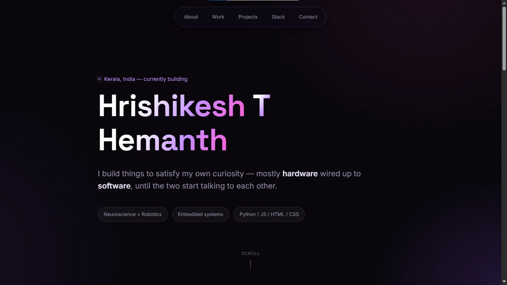

# Builder Page — Hrishikesh T Hemanth
 
Hi! I am Hrishikesh, a curious mind.this is a page that introduces me. 
this is designed in one of my favourite theme- dark glassmorphism
 
## Description
This is my Builder page, created for the Pixl "Raise your Builder Page" trial. It is a single-page website. Dark background, glowing purple and magenta highlights, glassmorphism cards and a few scroll and hover animations are my pages highlight. The two things I am most proud of, a BCI-driven wheelchair and a Jarvis-style assistant have their special areas near the top and there is a "More builds" section below that pulls from my GitHub and is designed to expand. Every time I release something new I just add it to a list, in script.js and it appears as a card no extra HTML required. No React, no build process, nothing to install. It is HTML, CSS and JS that you can open directly in a browser.
## Screenshots
 

 

 
## Getting Started
 Demo: https://hrishikesh599.github.io/
### Dependencies
 
* this is a basic static webpage, nothing to install here!!
* Any basic browser will do the job
 
### Executing program
* if your thinking how to run, just double click the index.html file, that's it
## Help
 
* if you are running it locally, and the font seems off, it might be because you have no internet or it slow, fonts needed to load.
* and if the pages seems of in animation, maybe some setting in your browser might block it, ensure it is not!
 
## License
 
This project is licensed under the MIT License - see the LICENSE.md file for details
 
